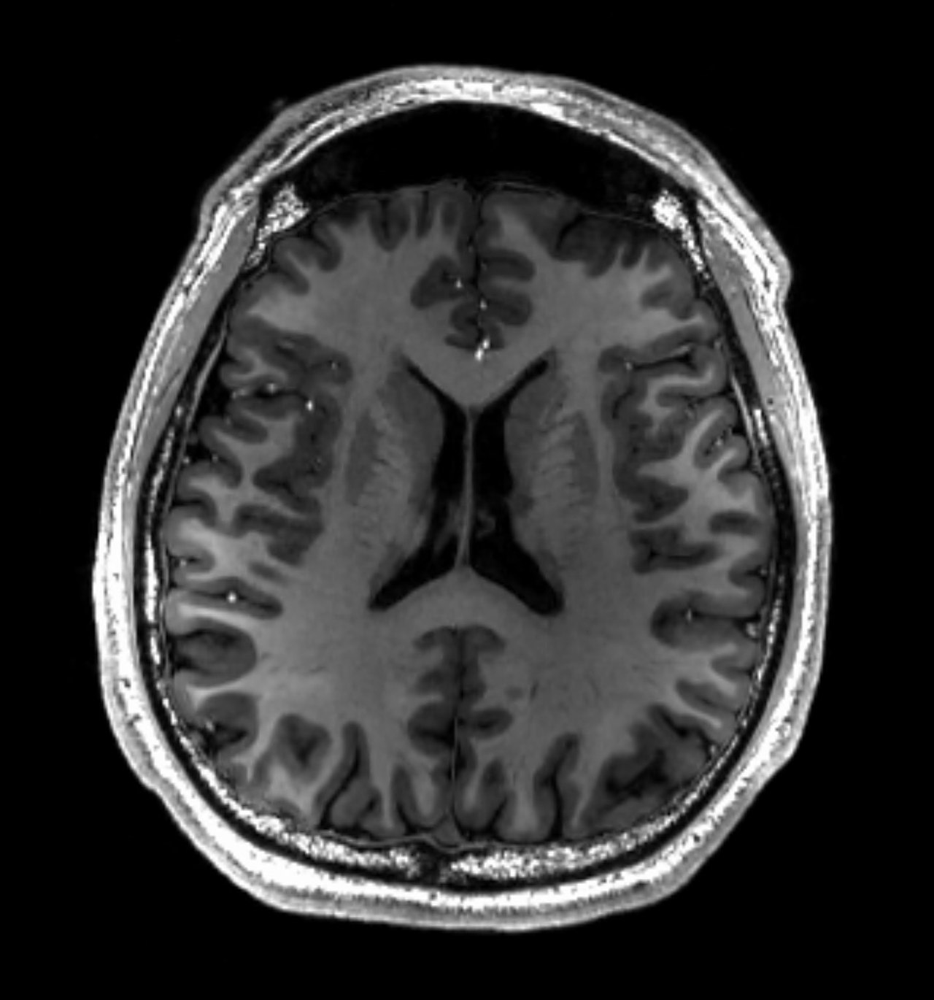
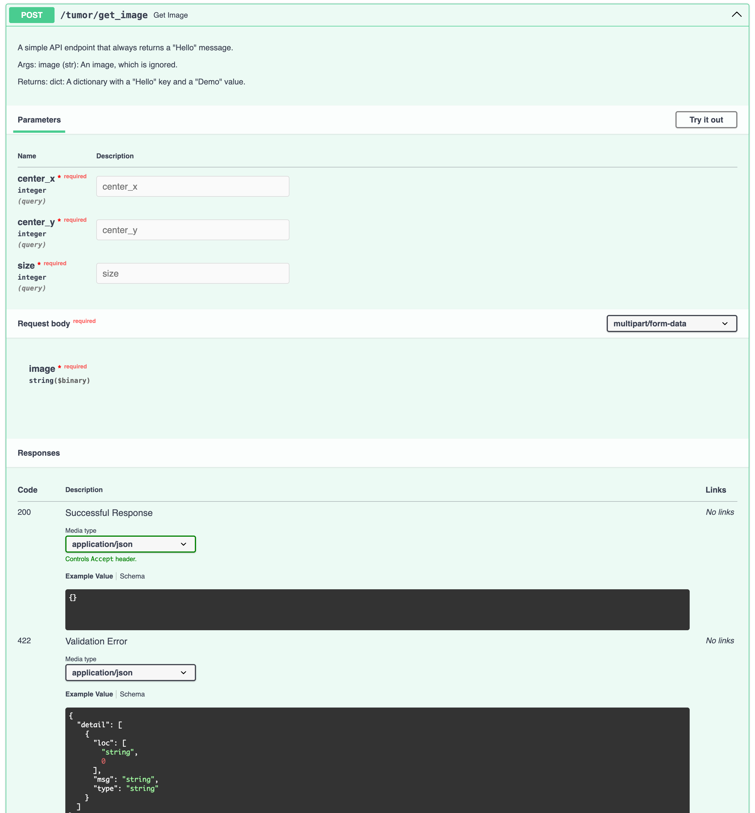
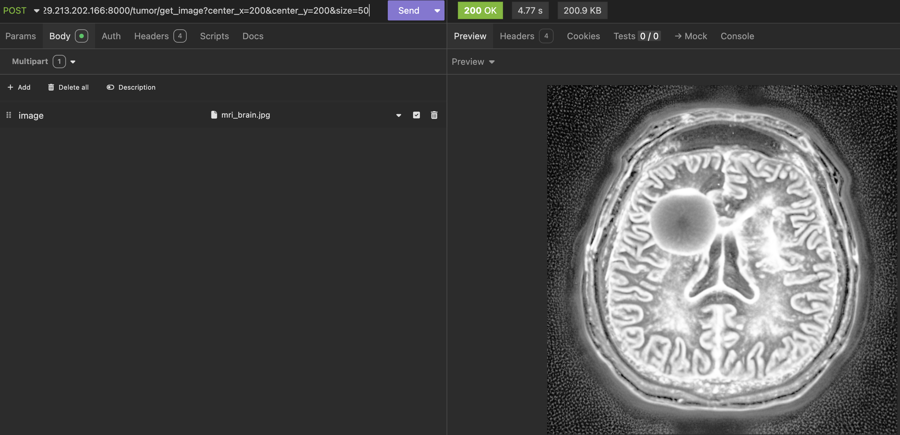

# ControlNetLib

Example project on integrating ControlNet into a ready-to-deploy repository.

To get started, clone the repository and init the submodule:
```
git clone https://github.com/ju-leon/ControlNetLib.git
cd ControlNetLib
git submodule init 
git submodule update
```

In a real-world scenario we might want to use a custom trained model. If you want to start with a pretrained model, you could go ahead and download StableDiffusion Canny Edge Model to the models folder:

```
mkdir models && cd models
wget https://huggingface.co/lllyasviel/ControlNet/resolve/main/models/control_sd15_canny.pth
```

## Docker

Docker can be used to easily deploy the application to new VMs. A Dockerfile setting up a container with all the needed prequireies is provided.

> **_NOTE:_**  ControlNet expects a CUDA capable GPU.

## Building docker container

This command will build the container with the name 'controlnet'. This may take a while.

```
sudo docker build -t controlnet .
```

## Launching an interactive container, e.g. for development
```
sudo docker run -v .:/repo -it --net=bridge -p 8000:8000 --gpus all controlnet bash
```

## Launching an inference container, e.g. for deployment

A docker container containing all the requirements can be launched using:
```
sudo docker build -t controlnet .
sudo docker run -v .:/repo --net=bridge -p 8000:8000  --gpus all controlnet /root/miniconda3/envs/control/bin/python rest_service.py config/tumor_application.ini
```

> **_NOTE:_**  The docker container does not contain or downloard pretrained weights. A vali path to model weights should be provided in config/tumor_application.ini, e.g. by downloading a pretrained model into models/

## Accesing over REST

Once the Docker container has been run successfull, REST post request can be placed on local ip and port 8000:
```
127.0.0.1:8000/
```

Documation for API calls are found under:
```
127.0.0.1:8000/docs
```

If you're runing the script on a remote machine, make sure to allow remote access to port 8000.

To generate a new image using the tumor example application, put a HTTP POST request to:
```
127.0.0.1:8000/tumor/get_image?center_x=200&center_y=200&size=50
```

The POST request should contain an mri image of a healty brain. The application will use ControlNet to generate a tomur at the specified location with specified size.



